# Full Stack Next.js 13 Admin Dashboard & CMS for E-Commerce Store | Next.js 13 App Router, React, Tailwind, Prisma, MySQL

This is the repository for a fully functioning [Admin Dashboard & CMS](https://ecommerce-admin-dashboard-next13-seven.vercel.app/).

Find the Github repository for the E-Commerce store here: https://github.com/demitraps/ecommerce-store-next13

## Features

- Create Multiple Stores
- Dashboard with stats
- Create billboards per different category
- Sizes/Colors
- Products linked to sizes, colors, billboards
- Archive/feature product
- Edit/Delete billboards, categories, sizes, colors
- Orders page with payment status
- API calls for Billboards, Categories, Sizes, Colors, Products
- Light and Dark mode
   
## Tech Stack

**React, Next.JS 13, TypeScript, TailwindCSS**

**Authentication:** Clerk
**Data validation:** Zod
**FileUploads:** Cloudinary
**Components:** Shadcn
**Database:** MySQL-PlanetScale with Prisma ORM

## Sign-in
https://ecommerce-admin-dashboard-next13-seven.vercel.app/

## Demo

Product creation: 

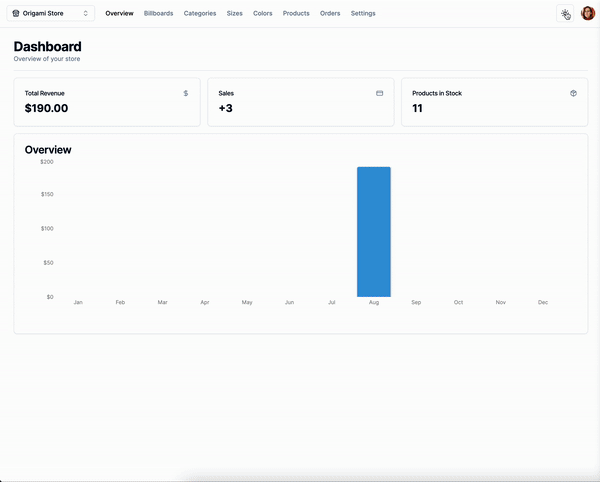

and in store: 


## Screenshots

Homepage:

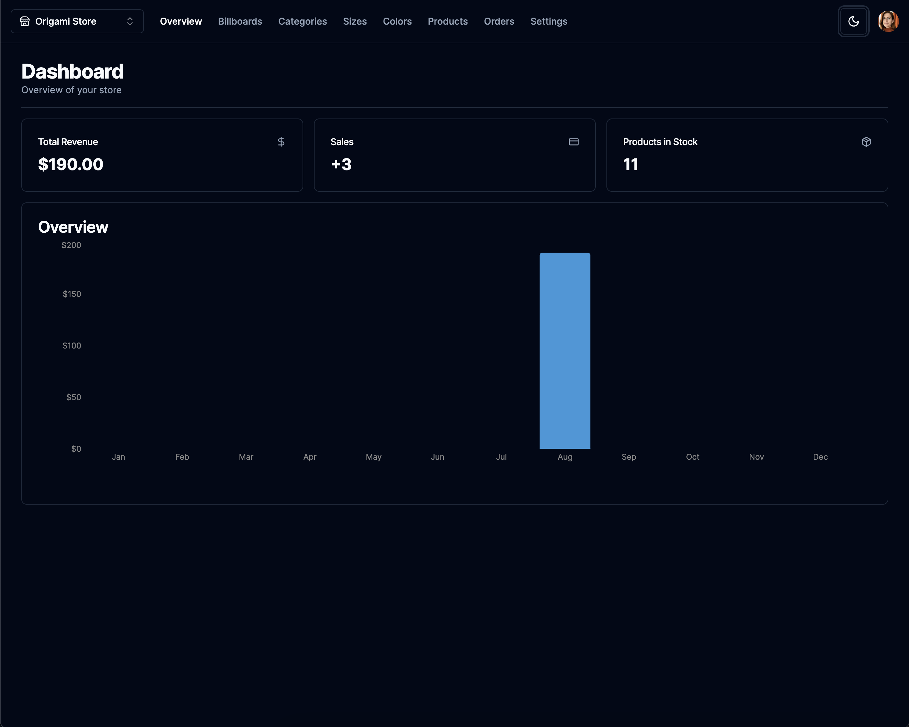

Create store:

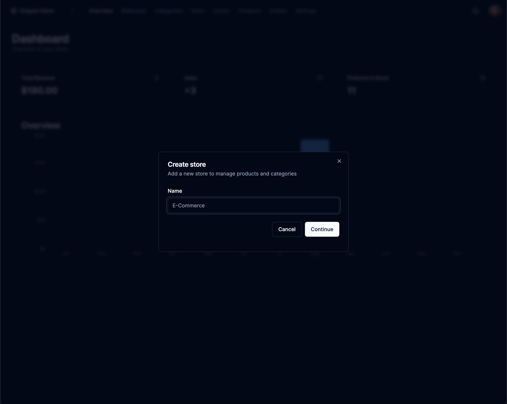

Billboards:

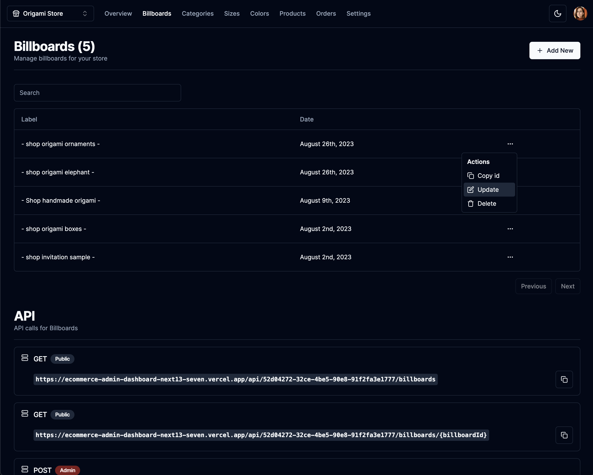

Create billboard:

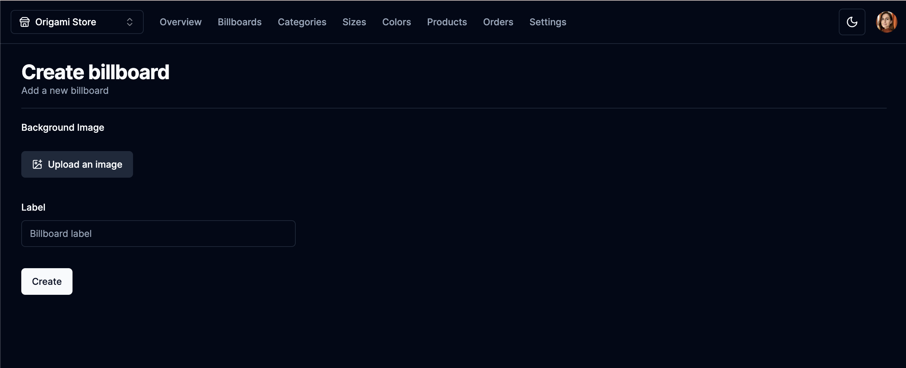

Categories:

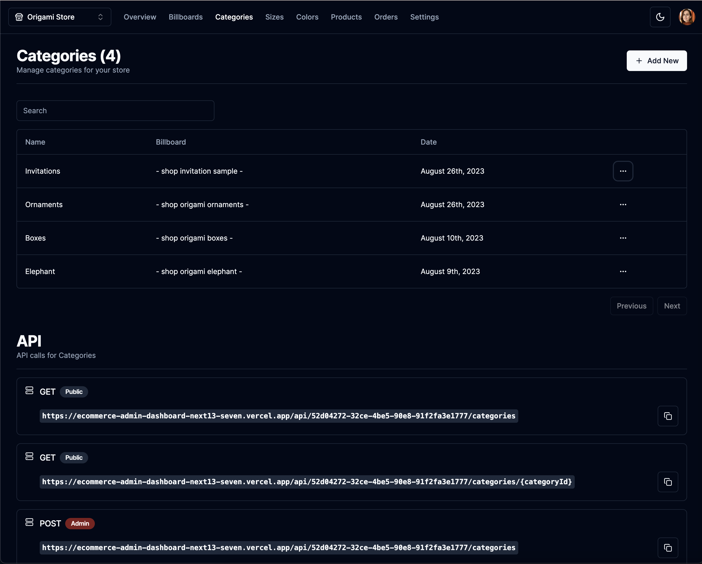

Sizes:

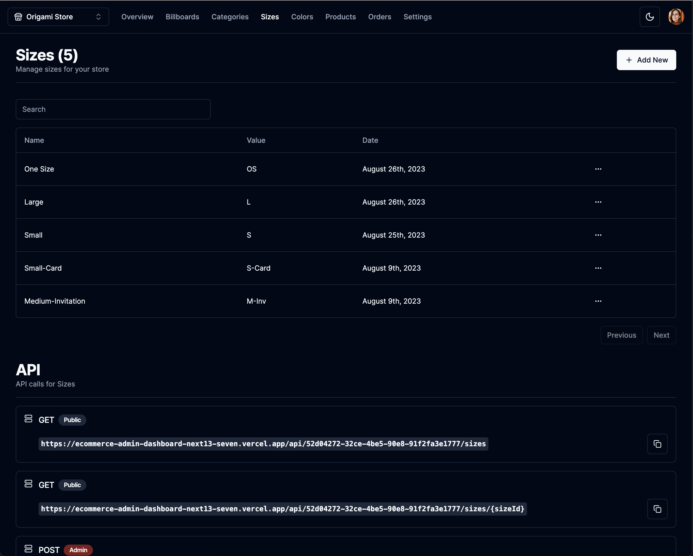

Colors:

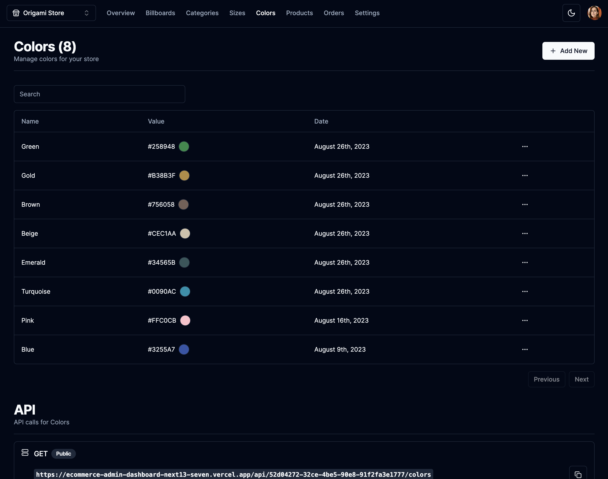

Products:

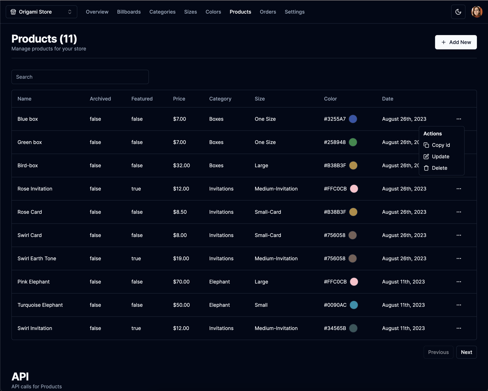

Create product:

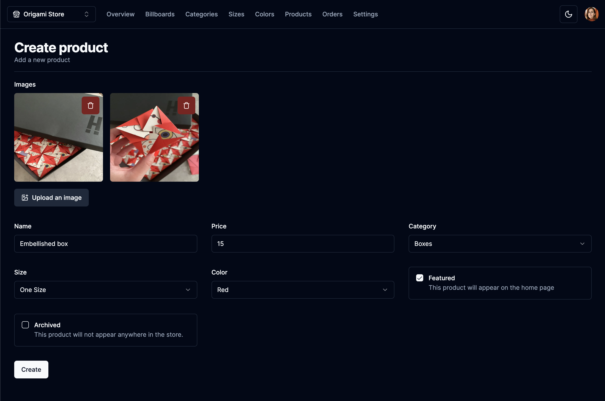

Orders:

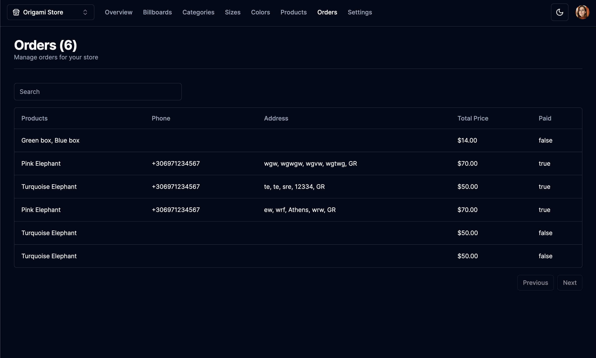

Settings:

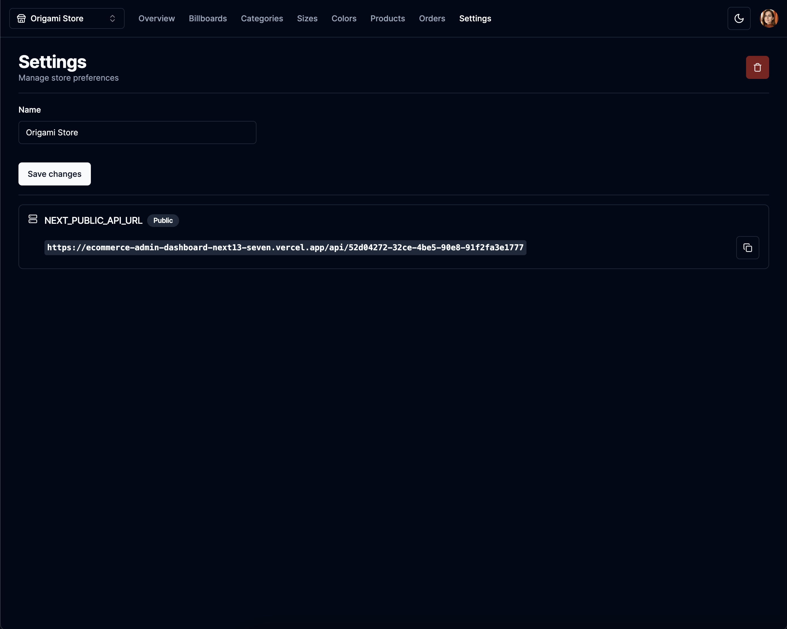

Light mode:

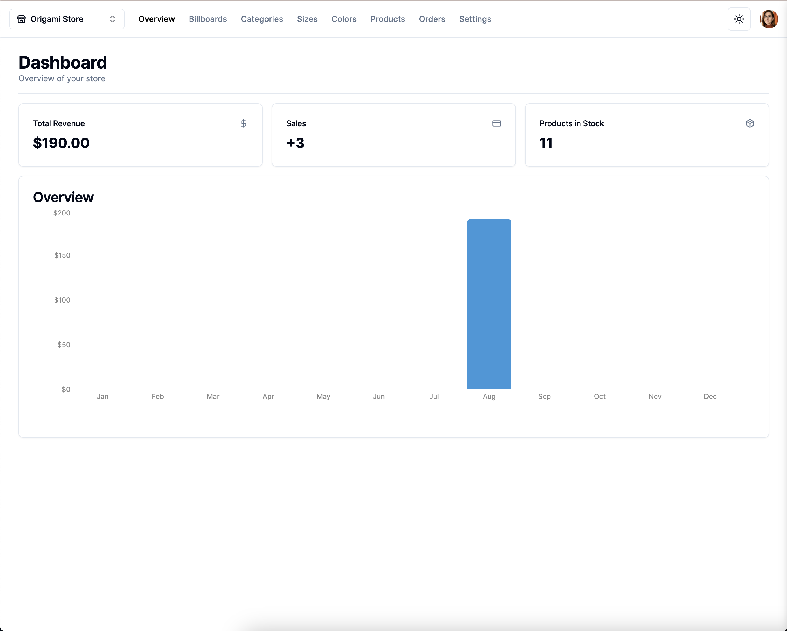

## To-Do List

- Multiple quantities per product
- Email notifications
- Video uploads
- Newsletters
- Additional stats
- Mark orders as complete
- Add tracking


### Prerequisites

**Node version 14.x**

### Cloning the repository

```bash
  git clone https://github.com/demitraps/ecommerce-admin-dashboard-next13.git
```

### Connect to PlanetScale and Push Prisma
```shell
npx prisma generate
npx prisma db push
```

### Start the app

```shell
npm run dev
```

## Available commands

Running commands with npm `npm run [command]`

| command         | description                              |
| :-------------- | :--------------------------------------- |
| `dev`           | Starts a development instance of the app |
